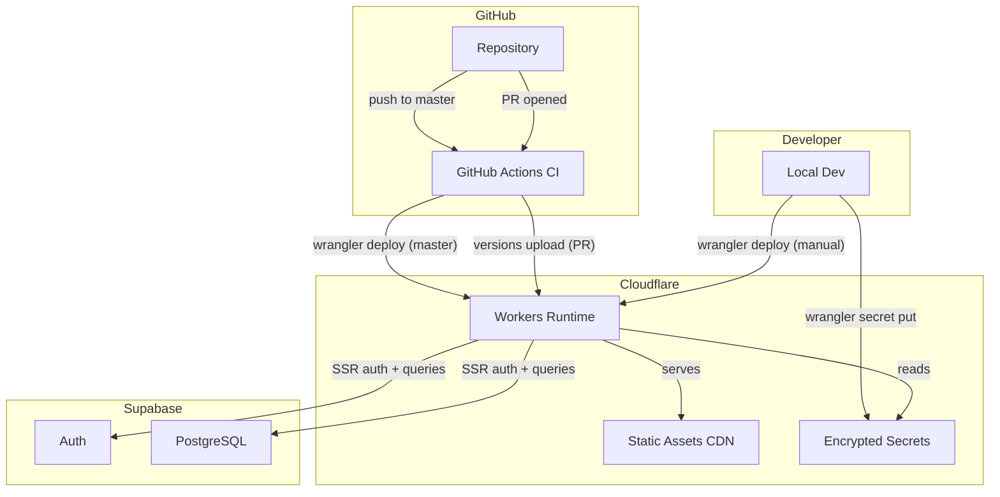

# Cloudflare Integration and Deployment Plan

Based on [context/foundation/infrastructure.md](../foundation/infrastructure.md), this plan implements the recommended Cloudflare Workers + Pages deployment in six phases. Each phase is self-contained and verifiable before moving to the next.

## Current State

- Astro 6.3.1 with `@astrojs/cloudflare` v13.5 adapter already installed
- `wrangler.jsonc` exists with `nodejs_compat` flag, assets binding, and observability enabled
- CI workflow at `.github/workflows/ci.yml` runs lint + build but has **no deploy step**
- Worker name is still `10x-astro-starter` (needs renaming to `ai-recruiter`)
- No `prerenderEnvironment` safety valve configured (risk item from infrastructure.md)
- Supabase secrets are injected at build time via GitHub Secrets but **not configured in Cloudflare Workers runtime**

---

## Phase 1 -- Config Hardening (no deploy yet)

Files touched: `wrangler.jsonc`, `astro.config.mjs`, `.env.example`

- [ ] **Rename the Worker** in `wrangler.jsonc`: change `"name": "10x-astro-starter"` to `"name": "ai-recruiter"`
- [ ] **Add `prerenderEnvironment: 'node'`** to the Cloudflare adapter in `astro.config.mjs` -- this is the "prerender safety valve" from infrastructure.md. Without it, any prerendered page that touches `@supabase/ssr` or Node.js APIs will silently fail under workerd at build time (confirmed in Astro docs and [withastro/astro#16396](https://github.com/withastro/astro/issues/16396))

```js
adapter: cloudflare({
  prerenderEnvironment: 'node',
}),
```

- [ ] **Add Cloudflare env vars to `.env.example`** so the next developer knows what's needed:

```
CLOUDFLARE_API_TOKEN=###
CLOUDFLARE_ACCOUNT_ID=###
```

- [ ] **Verify the build still passes locally** with `npm run build`

---

## Phase 2 -- Cloudflare Account & Secrets Setup (manual, one-time)

This phase is a manual prerequisite before any automated deploy can work. It produces the credentials that Phase 3 consumes.

- [ ] **Create a Cloudflare API Token** via dashboard (My Profile > API Tokens > Create Token). Use the "Edit Cloudflare Workers" template. Scope it to the target account only. Record the token value -- it is shown only once.
- [ ] **Find the Account ID** on the dashboard (Workers & Pages > Overview, right sidebar, or any Worker detail page).
- [ ] **Add GitHub Secrets** in the repo (Settings > Secrets and variables > Actions):
  - `CLOUDFLARE_API_TOKEN` -- the token from step 1
  - `CLOUDFLARE_ACCOUNT_ID` -- the account ID from step 2
- [ ] **Set Supabase runtime secrets in Cloudflare** (these are distinct from the build-time GitHub Secrets -- Workers needs them at request time):

```bash
npx wrangler secret put SUPABASE_URL
npx wrangler secret put SUPABASE_KEY
```

> **Edge case -- first deploy chicken-and-egg**: `wrangler secret put` requires the Worker to exist on Cloudflare. If the Worker hasn't been deployed yet, run `npx astro build && npx wrangler deploy` once first (it will deploy without secrets, app will return null from `createClient` but won't crash). Then set the secrets, and subsequent requests will work. No redeployment needed after setting secrets -- they take effect immediately.

---

## Phase 3 -- First Production Deploy (manual verification)

- [ ] **Build and deploy** from local machine:

```bash
npx astro build && npx wrangler deploy
```

- [ ] **Verify the production URL** (`ai-recruiter.<account>.workers.dev`):
  - Landing page loads (static assets served)
  - Auth flow works (signin/signup redirects, Supabase cookie set)
  - Protected route `/dashboard` redirects to `/auth/signin` when unauthenticated
  - After login, `/dashboard` renders correctly
- [ ] **Check runtime logs** for any workerd compatibility warnings:

```bash
npx wrangler tail --format=pretty
```

> **Edge case -- Supabase cookie truncation (8KB header limit)**: infrastructure.md flags this risk. Cloudflare raised their CDN header limit to 128KB (Oct 2025 changelog), but individual cookies can still cause issues if the JWT is large (multiple linked identities, Azure provider metadata). The current app uses email/password auth with no third-party providers, so this is **low risk for MVP**. If third-party OAuth is added later, monitor for `413` errors in `wrangler tail` and keep JWT custom claims minimal. Supabase SSR v0.10+ includes defensive chunked-cookie validation (PR [supabase/ssr#210](https://github.com/supabase/ssr/pull/210)) that returns `null` instead of crashing on corruption -- our middleware already handles `null` from `createClient`.

---

## Phase 4 -- CI/CD Pipeline with Preview Deploys

File touched: `.github/workflows/ci.yml`

Split the existing CI workflow into two jobs: **lint-build** (existing) and **deploy** (new, depends on lint-build).

- [ ] **Add a `deploy` job** that runs `cloudflare/wrangler-action@v3` after lint+build succeeds
- [ ] **Production deploy**: triggers on push to `master` -- runs `wrangler deploy`
- [ ] **Preview deploy**: triggers on PRs -- runs `wrangler versions upload` to create a preview URL without promoting to production
- [ ] **Pass build artifacts** between jobs via `actions/upload-artifact` / `actions/download-artifact` (the `dist/` folder)

Target workflow structure:

```yaml
jobs:
  lint-build:
    # (existing steps: checkout, setup-node, npm ci, astro sync, lint, build)
    # + upload dist/ as artifact

  deploy:
    needs: lint-build
    if: github.event_name == 'push' && github.ref == 'refs/heads/master'
    runs-on: ubuntu-latest
    steps:
      - uses: actions/checkout@v4
      - uses: actions/download-artifact@v4
      - uses: cloudflare/wrangler-action@v3
        with:
          apiToken: ${{ secrets.CLOUDFLARE_API_TOKEN }}
          accountId: ${{ secrets.CLOUDFLARE_ACCOUNT_ID }}

  preview:
    needs: lint-build
    if: github.event_name == 'pull_request'
    runs-on: ubuntu-latest
    steps:
      - uses: actions/checkout@v4
      - uses: actions/download-artifact@v4
      - uses: cloudflare/wrangler-action@v3
        with:
          apiToken: ${{ secrets.CLOUDFLARE_API_TOKEN }}
          accountId: ${{ secrets.CLOUDFLARE_ACCOUNT_ID }}
          command: versions upload
```

> **Edge case -- preview deploys are public by default**: infrastructure.md notes this. For an MVP with no sensitive data in previews, this is acceptable. If preview URLs must be protected, configure Cloudflare Access (free for up to 50 users) on the `*.workers.dev` subdomain pattern.

> **Edge case -- fork PRs and secrets**: GitHub Actions does not expose secrets to workflows triggered by fork PRs. If the repo ever accepts external contributions, the preview job will fail silently for fork PRs. Add an `if: github.event.pull_request.head.repo.full_name == github.repository` guard to skip the preview deploy for forks and avoid confusing CI failures.

---

## Phase 5 -- Operational Runbook

No code changes -- documentation and verification of operational procedures from infrastructure.md.

- [ ] **Rollback procedure**: verify `npx wrangler rollback` works by deploying a known-good version, then deploying a deliberate change, then rolling back. Confirm the rollback is instant.

> **Edge case -- DB migration + rollback mismatch**: infrastructure.md warns that `wrangler rollback` only rolls back application code, not Supabase schema migrations. If a deploy includes both a Worker update and a DB migration, rolling back the Worker may break against the forward-migrated schema. Mitigation: always make DB migrations backward-compatible (additive only -- new columns with defaults, no column renames/drops in the same deploy). Document this rule in `AGENTS.md`.

- [ ] **Monitoring**: confirm `wrangler tail` works with filters:

```bash
npx wrangler tail --status error
npx wrangler tail --search "SUPABASE"
```

- [ ] **Add a `deploy` and `rollback` script** to `package.json` for convenience:

```json
"deploy": "astro build && wrangler deploy",
"rollback": "wrangler rollback"
```

---

## Phase 6 -- Risk Mitigations from Infrastructure Register

These are proactive checks against the specific risks identified in infrastructure.md.

- [ ] **workerd compatibility smoke test**: after the first deploy (Phase 3), verify that `@supabase/ssr` `createServerClient`, `parseCookieHeader`, and cookie get/set operations work correctly in the Workers runtime. The current codebase only uses these Supabase SSR functions -- no `pdf-parse` or `mammoth` yet (those are future sprint 1 risks for CV upload). Log a finding if any `wrangler tail` output shows `Buffer` or `stream` compatibility warnings.
- [ ] **CPU budget awareness**: the free tier allows 10ms CPU per invocation. The current app (auth routes + page renders) is well within this. When the CV analysis pipeline (FR-006) is implemented later, it will likely need the $5/mo paid Workers plan (30s CPU cap). Add a comment in `wrangler.jsonc` documenting this threshold.
- [ ] **In-flight request safety**: infrastructure.md notes that `wrangler deploy` instantly replaces the Worker, potentially killing in-flight requests. For the current auth-only app this is a non-issue (requests complete in <100ms). When the 60-second analysis pipeline is added, implement client-side retry on 502/503 in the analysis React component.
- [ ] **Cross-network latency to Supabase**: each DB call crosses from Cloudflare edge to Supabase's region. Current app makes 1 DB call per request (auth check in middleware). Acceptable. When multi-query analysis pipelines are added, batch reads or consider Cloudflare Hyperdrive for connection pooling.

---

## Architecture after implementation



---

## Files modified summary

| File | Change |
|---|---|
| `wrangler.jsonc` | Rename worker, add CPU budget comment |
| `astro.config.mjs` | Add `prerenderEnvironment: 'node'` |
| `.env.example` | Add Cloudflare credential placeholders |
| `.github/workflows/ci.yml` | Add deploy + preview jobs |
| `package.json` | Add `deploy` and `rollback` scripts |
| `AGENTS.md` | Add backward-compatible migration rule |
